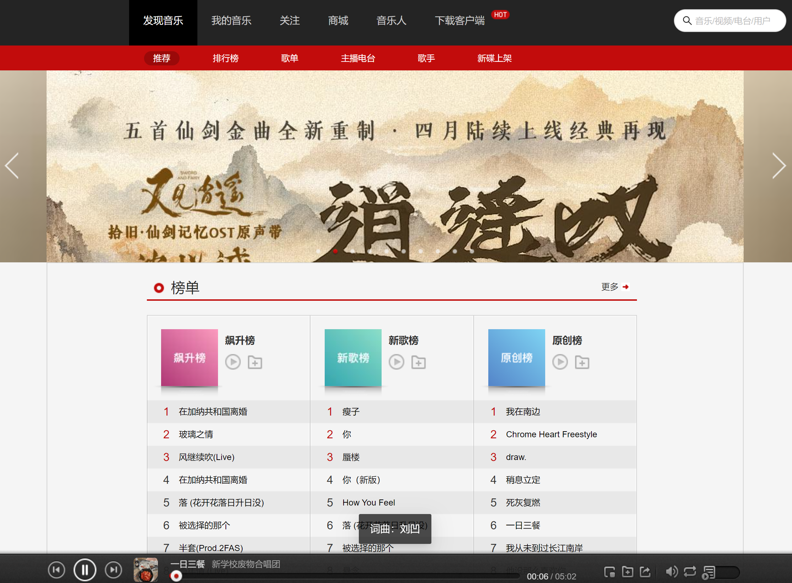

## 音乐网站

所有数据来自于网易云音乐平台

采用 create-react-app 脚手架搭建，借助 craco 修改 webpack 配置

技术栈：React, TypeScript, Styled-Components, craco

主要功能：
- 开始、暂停音乐播放
- 歌词匹配
- 播放进度拖拽
- 播放模式切换（循环播放、连续播放、随机播放）

仿网易云音乐，主要目的为业务练习

